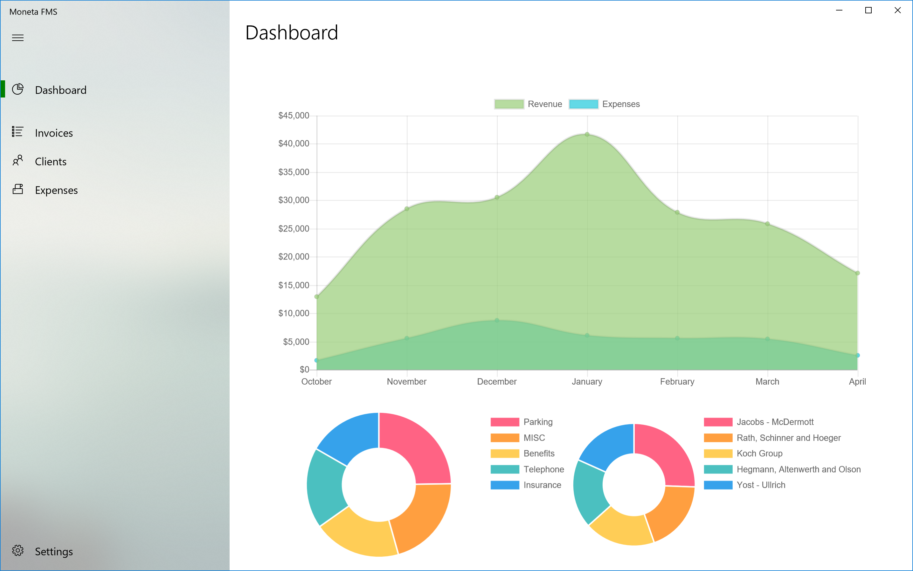
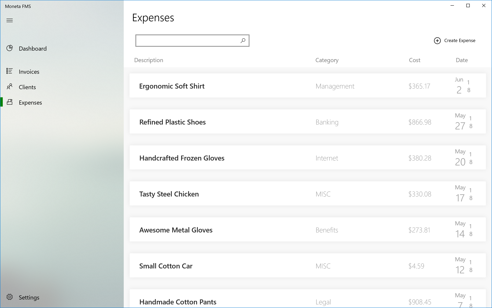

# Moneta

<h1 align="center">
   
  
</h1>

<h4 align="center">An open source easy to use accounting solution for freelancers, no strings attached.</h4>

Moneta is a Windows 10 desktop app :computer: which supports invoicing :page_facing_up:, expenses :money_with_wings:, client management :office: and business reporting :chart_with_upwards_trend:.

## App Screenshots
  

  

  

  

## Installing
Moneta can be installed directly from the Microsoft Store on Windows 10 devices (Fall Creators Update or newer). 

## Built With
* [Lottie UWP](https://github.com/azchohfi/LottieUWP) - Lottie Animations for UWP
* [iTextSharp-LGPL](https://github.com/schourode/iTextSharp-LGPL) - Invoice PDF Creation
* [Microsoft.Data.Sqlite](https://www.asp.net) - Local DB
* [Windows Community Toolkit](https://github.com/Microsoft/WindowsCommunityToolkit) - UI Elements
* [Newtonsoft.Json](https://www.newtonsoft.com/json) - JSON Parsing
* [Bogus](https://github.com/bchavez/Bogus) - Demo Data
* [Lottie Files](https://www.lottiefiles.com) - Lottie Animations

## Contributing

Please read [CONTRIBUTING.md](./CONTRIBUTING.md) for details on our code of conduct, and the process for submitting pull requests to us.

## Versioning

We use [SemVer](http://semver.org/) for versioning. For the versions available, see the [tags on this repository](https://github.com/TanayParikh/Moneta/tags). 

## Authors

* **Tanay Parikh** - [Website](https://tanayparikh.com) - [GitHub](https://github.com/TanayParikh)

## License

This project is licensed under the GNU GENERAL PUBLIC LICENSE Version 3 - see the [LICENSE.md](LICENSE.md) file for details

## Scope
### Initial Scope
- [x] Rewrite core application using UWP to improve overall user experience
	- [x] Updates to core UI/UX
	- [x] Replace the portable LAMP server needed for MYSQL with SQLite
	- [ ] Increase overall security. 
		- [ ] Authentication on start
		- [ ] Encrypted DB
	- [ ] Add non-intrusive, privacy friendly telemetrics to further improve UX	
	- [x] Autoupdater - Microsoft Store
	- [ ] High test coverage

### Future Plans
1. Private, self-hosted server capabilities
2. **Native** cross platform support
	a. Android
	b. iOS / MacOS

## Development Notes
**Why `Decimal` over `Double`?**
https://stackoverflow.com/questions/3730019/why-not-use-double-or-float-to-represent-currency/3730040#3730040
